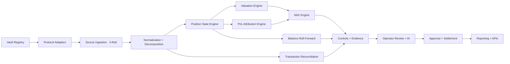
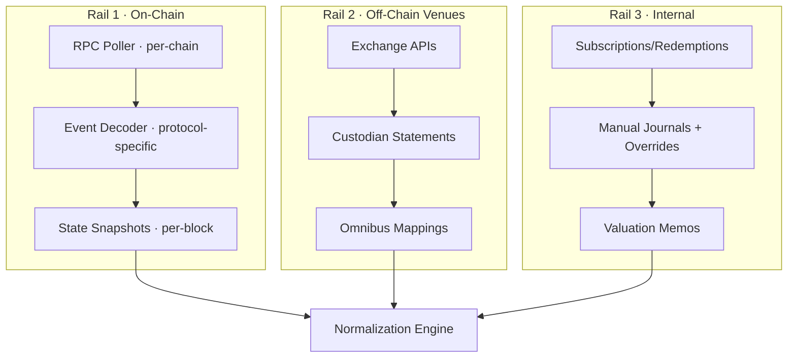
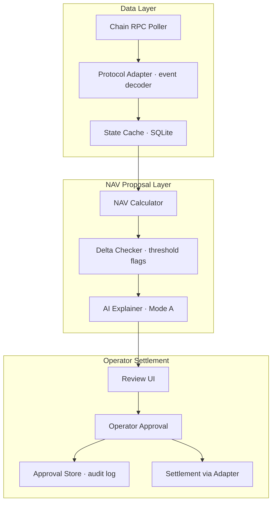
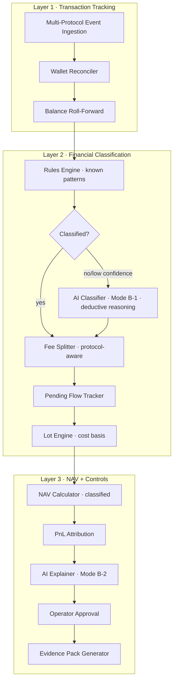

# NAV Reconciliation Engine — Architecture

> A protocol-agnostic NAV engine for DeFi vaults. Designed to work across ERC-4626, ERC-7540, and custom vault implementations.

---

## Design Principles

1. **Protocol-agnostic**: adapter layer abstracts vault differences — same engine works across Lagoon, MetaMorpho, Yearn, Concrete, custom vaults
2. **Event-first, not balance-first**: balances are outputs to validate against, not the only source of truth
3. **Position-aware, not token-aware**: LPs, vault shares, staking claims, wrappers, derivatives are distinct instruments
4. **Classify before NAV**: transactions must have accounting categories before touching NAV calculation
5. **Dual reconciliation**: tx matching + balance roll-forward, always
6. **Policy-separated**: accounting treatment, valuation policy, and fee logic are configurable — never hardcoded
7. **Provenance by default**: every derived number retains links to source facts

---

## High-Level Architecture



---

## Core Modules

### 1. Vault Registry

The control plane. Nothing enters the accounting flow without being registered here.

Each vault record captures: address, chain, protocol type (lagoon, metamorpho, yearn_v3, concrete, enzyme, custom), vault standard (ERC-4626, ERC-7540, custom), underlying asset and decimals, curator address, legal entity, strategy description, base currency, valuation policy, protocol-specific fee configuration, and adapter parameters.

### 2. Protocol Adapter Layer

Abstracts vault differences behind a uniform adapter. Each protocol has distinct NAV update mechanics:


| Protocol | Standard | NAV Update Model | Key Difference |
|----------|----------|------------------|----------------|
| **Lagoon** | ERC-7540 | External proposal → curator settlement (async, epoch-based) | Silo holds pending flows separately |
| **MetaMorpho** | ERC-4626 | Automatic via `lastTotalAssets` anchor (real-time) | Performance-only fees, JIT accrual |
| **Yearn V3** | ERC-4626 | `process_report()` per strategy (keeper-triggered) | Linear profit unlock buffer |
| **Concrete V2** | ERC-4626 | `_accrueYield` modifier (cached, per-interaction) | Three-party liveness model |
| **Enzyme V4** | Custom | ValueInterpreter + Chainlink (fully on-chain, real-time) | Continuous compounding fees |
| **dHEDGE** | Custom | `totalFundValue()` iteration (real-time) | Post-op value manipulation checks |
| **Generic ERC-4626** | ERC-4626 | `totalAssets()` view (implementation-dependent) | Fallback for unknown vaults |

### 3. Source Ingestion (Three-Rail)



**On-chain rail** captures: blocks, txs, receipts, logs, token metadata, protocol state reads.
**Off-chain rail** captures: exchange fills, balances, funding, fees, custodian statements.
**Internal rail** captures: approvals, overrides, hedge designations, valuation memos.

### 4. Normalization & Decomposition

Raw events become canonical accounting events. One user action may decompose into multiple sub-events.

**Example — LP deposit:**
1. Wallet outflow of token A
2. Wallet outflow of token B
3. Gas expense
4. Receipt of LP token
5. Protocol fee (if any)

**Canonical event fields:** source system (onchain/exchange/internal), chain, tx hash, block number, timestamp, event type (deposit, withdraw, yield_accrual, fee, swap, reward, ...), instrument type (spot, LP, lending, staking, vault_share, derivative, ...), asset in/out, quantity in/out, fee asset/quantity, position reference, counterparty, and a pointer to the raw event for audit provenance.

### 5. Position State Engine

Maintains explicit position state — NAV is never calculated solely from raw transactions.

**Position types:** spot, LP, lending, borrow liability, staking, vault share, wrapper/bridge claim, RWA claim, derivative leg, hedge group

Each position tracks: instrument type, asset, opening and current quantity, cost basis, accrued income, accrued fees, liability amount, liquidity metadata (lockups, unbonding, queue mechanics), and valuation inputs.

### 6. Valuation Engine

Policy-driven, instrument-specific. Best patterns from competitive research:

| Instrument | Method | Pattern Source |
|------------|--------|---------------|
| Spot | quantity × market price | Standard |
| LP position | decompose to underlying + unclaimed fees | 1Token |
| Lending | principal + `issuanceRate × elapsed` (continuous accrual) | Maple V2 |
| Staking | principal + accrued rewards (respect unbonding) | Standard |
| Vault share | `convertToAssets(shares)` via adapter | ERC-4626 |
| Wrapper/bridge | value underlying claim, not wrapper label | Standard |
| Derivative | mark-to-market from venue or model | Standard |
| Pendle PT | underlying price × yield factor convergence | 1Token |

**Valuation outputs:** market value, valuation method used, price source, price timestamp, confidence level (high/medium/low), and optional memo reference.

### 7. PnL Attribution Engine

Every NAV movement explained by economic driver:

| Bucket | Description |
|--------|-------------|
| Realized trading PnL | Lot-based, configurable cost basis (FIFO/HIFO/specific ID) |
| Unrealized market PnL | Current value − previous close value |
| Lending interest | Income/expense from lending protocols |
| Staking/farming rewards | Reward token income |
| LP fee income | Trading fees earned by LP positions |
| Impermanent loss | IL effect on LP positions |
| Derivative funding/carry | Funding rates, basis |
| Gas expense | Network fees (capitalize for acquisition, expense for income-generating) |
| Protocol fees | Fees charged by DeFi protocols |
| Management/performance fees | Fund-level fee accruals |
| Hedge PnL | Linked to exposure groups |
| FX PnL | If reporting currency differs from base |

**Position-level formula:**

```
Period PnL = Ending Fair Value - Beginning Fair Value
           - External Inflows + External Outflows
           + Realized Income - Direct Expenses
```

### 8. NAV Engine

Computed from reconciled position values, not from a single wallet sum.

**Portfolio close equation:**

```
Closing NAV = Opening NAV + Net Subscriptions + Realized PnL + Unrealized PnL + Income - Expenses
```

**Balance sheet view:**

```
NAV = Gross Assets - Liabilities - Accrued Fees - Pending Redemption Obligations
```

**NAV outputs:** total NAV, NAV per share/unit, gross exposure, net exposure, liquidity bucket view, liability bucket view, confidence/exception status.

### 9. Dual Reconciliation Engine

| Plane | Purpose | Equation | Catches |
|-------|---------|----------|---------|
| **Transaction rec** | Source events match internal records | on-chain tx ↔ internal event mapping | Missing/misclassified events |
| **Balance roll-forward** | Opening + activity = closing | `Opening Qty + Inflows - Outflows ± State Changes = Closing Qty` | Silent drift, accrual gaps |

**Both are required.** Transaction rec misses drift. Balance roll-forward misses misclassification.

### 10. Controls & Evidence

| Control | Why |
|---------|-----|
| Confirmation thresholds + reorg handling | Chain-specific finality (Avalanche ~2.3s, Ethereum ~13min) |
| Token decimal validation | Vaults may normalize decimals differently (Lagoon: always 18) |
| Stale price detection | Flag if `totalAssets()` unchanged despite activity |
| Self-transfer detection | Eliminate internal transfers from PnL |
| Bridge/wrapper parity | Verify wrapper represents actual underlying |
| Missing event detection | Flag when delta exists but no events |
| Post-operation value checks | dHEDGE pattern: `value_before - value_after ≤ withdrawn + tolerance` |
| Cut-off enforcement | Lock period for settlement |
| Immutable override logging | Every manual adjustment auditable |
| Maker-checker approval | Separate proposer from approver |

**Control outputs:** exception queue, unresolved delta report, data freshness report, daily rec status per vault, evidence pack per settlement.

### 11. AI Layer

Three modes, scaling with architecture phase:

**Mode A (MVP):** Anomaly detection + plain-English explanation
- Input: last N snapshots + delta + recent events
- Output: `{explanation, confidence: high|medium|low, warnings[]}`

**Mode B-1 (Classification):** Transaction classification with deductive reasoning
- Input: raw on-chain event (contract address, method, token flows, amounts, gas), vault context (protocol, strategy, known counterparties), and position state
- Process: AI reasons through the event step-by-step — what contract was called, what tokens moved where, what the vault's strategy is, what accounting category fits — and produces a classification with its reasoning chain
- Output: `{category, subcategory, reasoning_chain, confidence, needs_human_review: bool}`
- Categories: yield_accrual, swap, fee (mgmt/perf/protocol/gas), capital_movement (deposit/withdraw), reward_claim, liquidation, rebalance, unknown
- Why AI over rules alone: rules engines break on novel protocol interactions, multi-hop swaps, wrapped/bridged tokens, and new vault versions. AI handles the ambiguous tail with auditable reasoning. Rules handle the obvious 80%, AI classifies the remaining 20%

**Mode B-2 (Explanation):** PnL-aware explanation
- Input: classified transactions + fee breakdown + position changes
- Output: "NAV +0.48%: 0.52% yield accrual, -0.04% mgmt fee deduction"

---

## Architecture Phases

### Architecture A — MVP (Observe + Propose + Approve)



**Scope:** one vault, human always approves, local SQLite, basic warnings.

### Architecture B — Classified Accounting Engine



**Classification flow:** Rules engine attempts classification first. Known patterns (standard deposits, withdrawals, fee events) get classified deterministically. Unrecognized or ambiguous events fall through to AI classifier, which reasons through the raw event with full vault context and produces a category + auditable reasoning chain. Low-confidence AI classifications get flagged for human review.

**Scope:** multi-vault, AI-assisted transaction classification, fee decomposition, lot tracking, PnL attribution, audit-ready exports.
