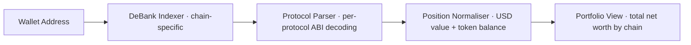
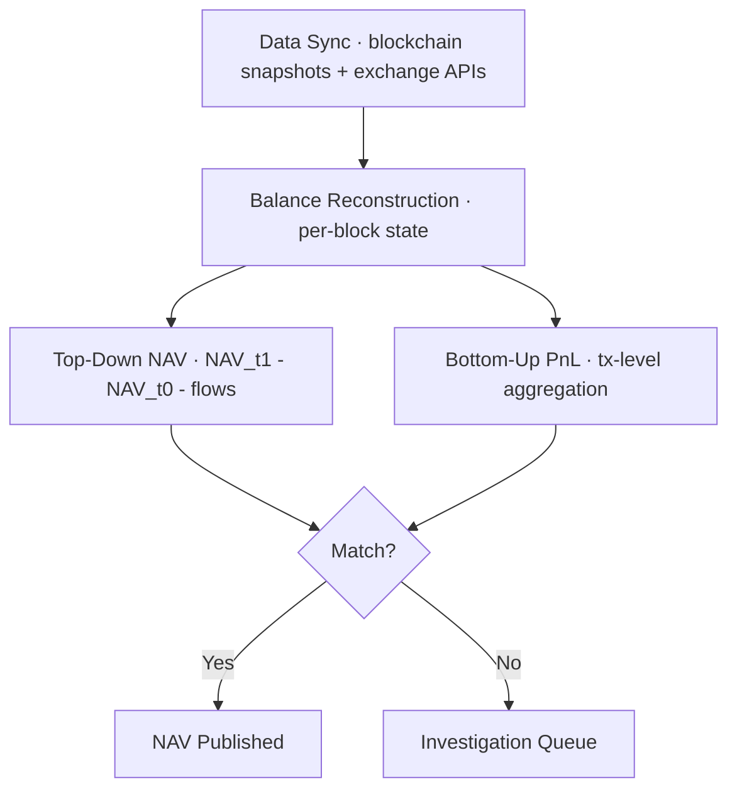
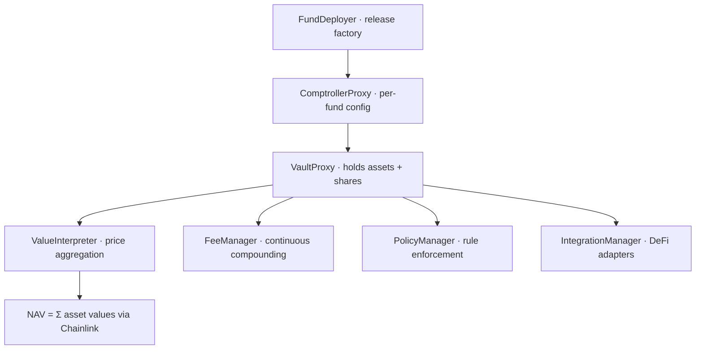
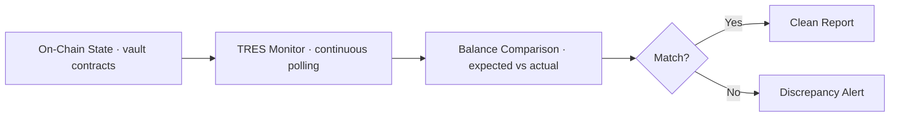
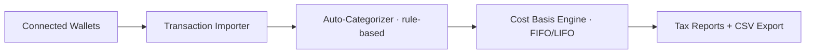
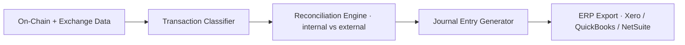

# NAV Engine — Competitive Architecture Comparison

> How each competing product is built, what architectural decisions they made, and what that means for us.

---

## Quick Matrix

| | **DeBank** | **1Token** | **Enzyme Onyx** | **TRES Finance** | **Octav** | **Cryptio** | **Ours** |
|---|---|---|---|---|---|---|---|
| Architecture | Off-chain indexer | Off-chain SaaS | Fully on-chain | Off-chain service | Off-chain SaaS | Off-chain SaaS | Hybrid (adapter + AI) |
| NAV method | `Σ(balance × price)` | Dual top-down/bottom-up | Chainlink ValueInterpreter | Balance comparison | Balance snapshots | Balance snapshots | Adapter + dual rec + AI |
| Reconciliation | None | Dual | On-chain only | Continuous off-chain | Periodic | Periodic | Dual + roll-forward |
| Settlement | Read-only | Report-only | On-chain | Report-only | Read-only | Read-only | **Propose → Approve → Settle** |
| AI | No | No | No | No | No | No | **Yes** |

---

## 1. DeBank

**What it is:** Read-only DeFi portfolio tracker. 250+ protocols, 30+ chains. Free.

**How it works technically:**



DeBank runs chain-specific indexers that crawl every supported protocol. For each protocol, a custom parser decodes contract state (`balanceOf`, LP positions, staking claims) into a normalized position format. NAV = `Σ(token_balance × market_price)` via live `balanceOf` queries.

**Core architecture decisions:**
- **Read-only by design** — no write path, no approval flow, no settlement
- **Protocol parsers are the moat** — 250+ hand-written adapters give widest coverage
- **Balance-first** — queries current state, doesn't track history or deltas
- **No accounting layer** — cannot classify transactions or attribute PnL

**Key architectural insight:** DeBank proves that protocol-specific adapters are the only way to accurately read DeFi positions. But read-only coverage without accounting is a dashboard, not a fund tool. We need the adapter approach but must add classification, reconciliation, and settlement on top.

---

## 2. 1Token

**What it is:** Full fund accounting SaaS. PMS + RMS + reconciliation + reporting. SOC 2 certified. 80+ clients managing $20B+ AUM.

**How it works technically:**



Two parallel NAV calculations run on every cycle:
- **Top-down:** `NAV_delta = NAV_t1 - NAV_t0 - net_flows` — fast sanity check
- **Bottom-up:** Transaction-level PnL aggregation per protocol (documented formulas for Pendle PT/YT/LP, GMX, Uniswap)

Discrepancies between the two trigger investigation. Protocol-specific PnL decomposition separates: cash PnL, yield PnL, IL, rewards, fees. Handles the "no transaction record" problem (e.g., GMX LP with 2 txs over 50 days) via snapshot-based balance diffs.

**Core architecture decisions:**
- **Dual reconciliation** — top-down + bottom-up is the gold standard. Catches errors single-approach misses
- **Snapshot-based** — reads protocol state at block heights rather than replaying every tx. Pragmatic for DeFi where balance changes happen without txs
- **Off-chain only** — no on-chain verification or transparency. Closed-source
- **Manual protocol integration** — each new DeFi protocol requires custom work

**Key architectural insight:** 1Token's dual rec approach is correct and we adopt it. But their off-chain-only, closed-source model creates latency vs chain state and vendor lock-in. We build the same dual rec as an open adapter layer with on-chain settlement integration.

---

## 3. Enzyme Finance (Onyx)

**What it is:** Fully on-chain fund infrastructure (since 2019). Onyx separates fund admin (NAV, compliance) from strategy execution. Most mature on-chain fund accounting.

**How it works technically:**



NAV is computed fully on-chain via `ValueInterpreter` which aggregates Chainlink feeds for primitives (ETH, USDC) and custom derivative feeds (cTokens, LP tokens) into a unified valuation. Management fees use continuous compounding: `sharesDue = (rpow(scaledPerSecondRate, seconds, 1e27) - 1e27) × totalSupply / 1e27`. Policies enforce rules (whitelists, concentration limits) at contract level.

**Core architecture decisions:**
- **Fully on-chain** — zero off-chain dependency for NAV. Maximum transparency
- **Oracle-dependent** — NAV accuracy = Chainlink accuracy. Exotic assets may lack coverage
- **Vault-locked** — only works with Enzyme vaults. Not protocol-agnostic
- **Continuous fees** — mathematically rigorous per-second compounding (most accurate in DeFi)

**Key architectural insight:** Enzyme proves fully on-chain NAV is possible but the trade-off is gas cost and protocol lock-in. Their `ValueInterpreter` pattern (single aggregation point for pricing) is elegant. We adopt the concept as our Valuation Engine but run it off-chain with on-chain verification, avoiding gas cost while maintaining auditability.

---

## 4. TRES Finance

**What it is:** Off-chain accounting reconciliation service. Used by Concrete V2 as their independent verification layer. Not a product — a B2B partnership service.

**How it works technically:**



TRES monitors specific vault contracts continuously, comparing expected balances (from tracked events) against actual on-chain state. Discrepancies surface as alerts. Combined with Hypernative (real-time anomaly detection) for Concrete's three-party verification model.

**Core architecture decisions:**
- **Service model** — tied to specific protocol partnerships, not self-serve
- **Balance comparison only** — no PnL attribution or transaction classification
- **No operator workflow** — produces reports but no approval UI or settlement integration
- **Independent third-party** — the value is institutional trust from separation of concerns

**Key architectural insight:** TRES validates the market need for independent NAV verification. But being a service (not a product) limits scale. We build the same independent verification as a deployable engine, adding AI explanation, PnL attribution, and operator approval that TRES doesn't offer.

---

## 5. Octav

**What it is:** DeFi accounting for crypto teams. Transaction categorization, cost basis, tax reporting. Bookkeeping focus.

**How it works technically:**



Imports wallet activity, auto-categorizes transactions into accounting buckets (income, expense, capital gain/loss), applies cost basis methods, generates tax reports.

**Core architecture decisions:**
- **Bookkeeping-oriented** — designed for accountants, not vault operators
- **Periodic** — no real-time reconciliation
- **Shallow DeFi depth** — doesn't decompose LP positions, staking, or yield tokenization
- **Tax-first** — optimized for tax report generation, not NAV verification

**Key architectural insight:** Different target user. Octav solves "how do I do my crypto taxes?" — we solve "is this NAV correct and can I prove it?" No overlap on core architecture, but their transaction categorization UX is well-designed.

---

## 6. Cryptio

**What it is:** Crypto accounting platform for finance teams. Transaction reconciliation, journal entries, ERP integration. Audit-ready.

**How it works technically:**



Imports data from chains and exchanges, classifies transactions, reconciles against internal records, generates journal entries for ERP systems. Emphasizes single source of truth and multi-entity support.

**Core architecture decisions:**
- **ERP bridge** — core value is crypto → traditional accounting systems
- **Periodic reconciliation** — not continuous
- **No fund-level NAV** — doesn't compute share price or attribution
- **No DeFi position awareness** — treats everything as transactions, not positions

**Key architectural insight:** Cryptio solves the "last mile" problem of getting crypto data into ERP. We could feed Cryptio downstream — our classified events + evidence packs → their journal entry generator. Complementary, not competitive, at the output layer.

---

## Architecture Comparison

### How Each Computes NAV

```
DeBank:    balanceOf() × price → sum → done (no accounting)
1Token:    snapshot balances → top-down delta + bottom-up tx agg → dual verify
Enzyme:    Chainlink feeds → ValueInterpreter → on-chain NAV (real-time)
TRES:      expected balance → compare vs actual → flag gaps (no NAV calc)
Octav:     balance snapshot → categorize → cost basis (tax-oriented, not NAV)
Cryptio:   balance snapshot → classify → journal entries (ERP-oriented, not NAV)
Ours:      adapter reads → classify → dual rec → AI explain → operator approve → settle
```

### Trust Models

```
DeBank:    Trust DeBank's indexer (no verification)
1Token:    Trust 1Token's platform (SOC 2 certified, closed-source)
Enzyme:    Trust Chainlink oracles (on-chain, verifiable)
TRES:      Trust TRES as independent third party (service relationship)
Octav:     Trust Octav's categorization (no independent verification)
Cryptio:   Trust Cryptio's classification (audit trail but no independent rec)
Ours:      Verify via dual rec + AI scoring + operator approval + wallet signature
```

---

## Sources

- [DeBank](https://debank.com/)
- [1Token](https://1token.tech/)
- [Enzyme / Onyx](https://enzyme.finance/)
- [TRES Finance](https://tres.finance/)
- [Octav](https://octav.fi/)
- [Cryptio](https://cryptio.co/)
- [Concrete V2 docs](https://docs.concrete.xyz/) — TRES integration reference
