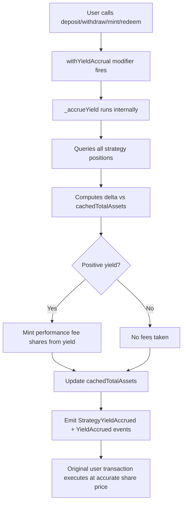

# NAV Reconciliation — Research

> Compiled: 2026-03-24
> Distilled from 28+ sources, 4 resource documents, and protocol-level technical research
> Target vault: Lagoon USDC Vault `0x3048...54af` on Avalanche (43114)

---

## 1. The Problem

DeFi fund accounting has no back office. Protocols pool liquidity, settle at block level, and produce no per-investor transaction records. A 50-day GMX LP position may show only 2 explicit transactions despite continuous balance changes every block.

**Three failure modes institutions hit:**

| Failure | Cause | Impact |
|---------|-------|--------|
| Stale NAV | Balance queries without yield accrual | Arbitrage against passive depositors |
| Missing attribution | Wallet balances treated as the only truth | Cannot explain *why* NAV moved |
| Reconciliation gaps | Spreadsheets, CSV glue, manual categorization | Audit delays, misstated financials, LP trust erosion |

**Why DeFi is different from CeFi:** Smart contracts pool liquidity from many users. The protocol settles trades at block level. Individual LP positions change as others enter/exit — like a hedge fund where trading happens at fund level, not per-investor. There ARE balance movements every block, but NO detailed transaction records for them.

---

## 2. How Lagoon Vaults Actually Work

Lagoon uses **ERC-7540** (async extension of ERC-4626), not plain ERC-4626.

### Core Flow

```
User → requestDeposit() → Silo holds assets
                              ↓
Valuation Provider → updateNewTotalAssets(value) → proposes NAV
                              ↓
Curator (Safe) → settleDeposit(value) → accepts NAV, takes fees, mints shares
                              ↓
User → deposit()/mint() → claims shares
```

### Key Contract Functions

| Function | Who | What |
|----------|-----|------|
| `updateNewTotalAssets(uint256)` | Valuation Provider | Proposes NAV — stored but not applied |
| `settleDeposit(uint256)` | Curator | Accepts NAV, takes fees, settles all queued deposits |
| `settleRedeem(uint256)` | Curator | Accepts NAV, settles redemptions (requires assets in curator address) |
| `totalAssets()` | View | Current total assets under management |
| `convertToShares(uint256)` | View | Asset-to-share conversion at current NAV |
| `updateTotalAssetsLifespan(uint128)` | Admin | Enable sync deposits for N seconds |
| `requestDeposit(assets, controller, owner)` | User | Async deposit request → assets go to Silo |
| `requestRedeem(shares, controller, owner)` | User | Async redeem request → shares go to Silo |
| `claimSharesOnBehalf(address[])` | Curator | Batch-claim shares for multiple users |

### Critical Design Details

- **Async deposits/redemptions**: request → settle → claim (prevents front-running)
- **Epoch-based**: each `updateNewTotalAssets` creates a new epoch. `EpochData` tracks per-address deposits/redeems
- **Fees**: management (cap 10%) + performance with high-water mark (cap 50%) + entry/exit + Lagoon protocol fee (~10%, cap 30%), all minted as shares at settlement
- **Sync mode optional**: `updateTotalAssetsLifespan(seconds)` enables instant deposits while NAV is fresh — risk: stale valuations create arbitrage
- **Vault decimals**: always 18, regardless of underlying asset
- **Four roles**: Vault Admin, Valuation Manager, Curator (Safe multisig), Whitelist Manager (KYC/KYB)
- **SDK**: `@lagoon-protocol/v0-viem` (TypeScript, inspired by Morpho SDK)
- **Subgraph**: Goldsky on Avalanche

### Our Vault

- **Address**: `0x3048925b3ea5a8c12eecccb8810f5f7544db54af`
- **Chain**: Avalanche (43114)
- **Asset**: USDC
- **Curators**: Tulipa Capital & 9Summits
- **TVL**: ~$2.93M
- **Fees**: 1% management, 10% performance
- **Share price**: ~$1.03
- **Factory**: `0xC094C224ce0406BC338E00837B96aD2e265F7287`

---

## 3. accrueYield - Fully Onchain Solution

The real Concrete V2 `_accrueYield` is a **Solidity modifier** inside the vault contract:



**Three-Party Liveness Model** (when no users interact): Off-chain Transaction Proposer monitors balances → Independent Signer validates (maker-checker) → Smart contract rejects updates outside expected yield ranges.

**Why cached accounting matters:** (1) inflation attack immunity — ignores "donated" funds, (2) gas efficiency — no per-read strategy queries, (3) share price always correct at point of interaction.

**Key events** (subgraph-indexed): `StrategyYieldAccrued`, `YieldAccrued`, `PerformanceFeeAccrued`

---

## 4. DeFi PnL Categories & Protocol Landscape

### Two Reconciliation Approaches

| Approach | Method | Trade-off |
|----------|--------|-----------|
| **Pure Bottom-Up** | List each block's balance movements as virtual transactions | Perfect mirror of on-chain, but huge data cost |
| **Hybrid** (recommended) | On-chain txs for fund in/out; top-down balance movement for classification | Efficient, but may mix PnL types in top-down pass |

### DeFi Activity Types & PnL Items

| Type | Protocols | PnL Items |
|------|-----------|-----------|
| **Wallet** (swap/transfer) | ETH, Solana wallets | Realized trading PnL, gas |
| **Single-Coin Staking** | Lido, Compound, AAVE, Blast | Interest income/expense, reward tokens, gas |
| **Uniswap V2 AMM** (LP token) | Uniswap V2, Sushiswap | Cash unrealized PnL, IL, trading fee income, rewards, gas |
| **Uniswap V3 AMM** (NFT LP) | Uniswap V3, PancakeSwap V3 | Same as V2 but range-dependent |
| **Multi-Coin AMM** | Curve, Balancer | Same + multi-asset IL complexity |
| **LP Re-staking** | Convex, EigenLayer | Staking rewards on top of LP income |
| **Perpetual Swap AMM** | GMX, dYdX | Cash + derivatives unrealized/realized PnL, funding fee, trading fee income, rewards, gas |
| **Options** | Opyn, Lyra | Premium, delta PnL, expiry settlement |

### GMX Perpetual LP — Full PnL Breakdown

Cash Unrealized PnL, Impermanent Loss, Derivatives Position Unrealized PnL, Cash Realized PnL, Derivatives Realized PnL, Reward, Trading Fee Income, Gas Fee, Commission Fee, Funding Fee

### Pendle — Yield Tokenization (Important Case Study)

Pendle splits yield-bearing assets into **Principal Token (PT)** and **Yield Token (YT)**:

| Token | Behavior | PnL |
|-------|----------|-----|
| **PT** | Zero-coupon bond. Converges to underlying at maturity | `Profit = (x0/y0)*(P_A' - P_A) + [(x1/y1) - (x0/y0)]*P_A'` → cash balance PnL + yield factor PnL |
| **YT** | Streams yield + points. Decays to $0 at maturity. Leveraged yield exposure | `Profit = (Yield + Airdrops) - Cost` |
| **LP** | AMM of PT + SY. No IL if held to maturity | SY yield + PT fixed APY + swap fees + PENDLE incentives |

---

## 5. Curator Infrastructure & Market Context

### Market State (2025-2026)

- Curator TVL: $300M → $7B in <1 year (2,200% growth). Over half on Ethereum
- Top curators: Gauntlet (~$1.88B), Steakhouse (~$1.26B), MEV Capital
- Top 5 control ~43% of market
- Business model: performance fees on yield. Some use 0% fees on largest vaults to attract liquidity

### Aave vs Morpho — Two Design Philosophies

| Aspect | Aave | Morpho |
|--------|------|--------|
| Risk management | Protocol manages everything | Decentralized to curators |
| Market structure | Shared pools | Isolated markets per vault |
| Liquidity | Deep, fast, broad | Fragmented, vault-specific |
| User experience | Simple, no decisions | Must evaluate each vault |
| Risk isolation | Shared risk | Isolated per vault |

**Key tradeoff:** Aave = simplicity + liquidity vs shared risk. Morpho = flexibility + isolation vs fragmentation.

### The "Really Bad Week" — November 2025

**Balancer v2 exploit (Nov 3):** Precision rounding bug in stable swap math. ~$130M drained from a 5-year-old, heavily-audited protocol.

**Stream Finance / xUSD collapse:** External fund manager lost ~$93M. xUSD (staked stablecoin) depegged to ~$0.30. xUSD was widely rehypothecated as collateral across the ecosystem — forced peg defenses, position unwinds, gated exits.

**Cascade effect on Morpho vaults:**
- Only 1 of ~320 MetaMorpho vaults had direct xUSD exposure (~$700K bad debt)
- But even "safe" USDC vaults became illiquid due to: isolated-market design (no shared liquidity), simultaneous withdrawals, 100% utilization triggering queues, interest rates spiking to 190%
- 80% of withdrawals completed within 3 days — isolation worked but revealed: localized liquidity drains fast even with minimal losses

**Root cause:** Curators treated xUSD as "dollar-equivalent collateral" when it should have been treated as a risky credit instrument. Weak standards in collateral classification.

### Four Recurring Curator Weak Points

| Weak Point | Detail |
|------------|--------|
| **Centralization** | Most run from EOAs or operator-controlled multisigs |
| **Rehypothecation** | Collateral reused across vault chains — circular lending inflates TVL |
| **Conflict of interest** | Curators judged on growth vs optimal risk management |
| **Transparency** | Users lack telemetry to verify where risk sits and how it's marked |

### What Curators Need to Become Institutional

- Hard collateral constraints (not just recommendations)
- Standardized ratings (like Moody's/S&P — DeFi has none today)
- Investment advisor registration + KYC + institutional custody
- Risk policy encoded in contracts/config, not PDFs and governance threads
- Bounded execution rights with inspectable constraints

---

## 6. Intent Standards & The Curator Stack

**The insight:** Solver infrastructure (intents) is commoditizing. The value layer shifts to **deciding what intent to fire** — that's where curators come in.

- Users don't know what intent they want (Vanguard manages $10T — users don't care how trades execute in their ETFs)
- Curators who understand strategy + risk capture the value
- For accounting: preserve **decision provenance** for allocation actions, not just the final tx payload
- Separate strategy-intent records from execution records in the event model

---

## 7. NAV Calculation Requirements

### Portfolio Close Equation

```
Closing NAV = Opening NAV + Net Subscriptions + Realized PnL + Unrealized PnL + Income - Expenses
```

### Balance Sheet View

```
NAV = Gross Assets - Liabilities - Accrued Fees - Pending Redemption Obligations
```

### Valuation by Instrument Type

| Instrument | Method |
|------------|--------|
| Spot | quantity × market price |
| LP position | decompose to underlying + unclaimed fees |
| Lending | principal + accrued interest − impairment |
| Staking | principal + accrued rewards (respect unbonding) |
| Wrapper/bridge | value underlying claim, not wrapper label |
| Derivative | mark-to-market from venue or model |
| RWA-backed | market price if policy allows; else reserve/redemption logic |
| Pendle PT | underlying price × yield factor convergence |
| Pendle YT | accrued yield + airdrop value − purchase cost (decays to 0) |

---

## 8. PnL Attribution Buckets

Every NAV movement must be explained by one of these drivers:

| Bucket | Description |
|--------|-------------|
| Realized trading PnL | Lot-based, configurable cost basis (FIFO/HIFO/specific ID) |
| Unrealized market PnL | Current value − previous close value |
| Lending interest | Income/expense from lending protocols |
| Staking/farming rewards | Reward token income |
| LP fee income | Trading fees earned by LP positions |
| Impermanent loss | IL effect — not a separate journal entry, shows in realized PnL at close |
| Derivative funding/carry | Funding rates, basis |
| Gas expense | Capitalize for asset acquisition, expense for income-generating |
| Protocol fees | Fees charged by DeFi protocols |
| Management/performance fees | Fund-level fee accruals |
| Hedge PnL | Linked to exposure groups — separate standalone vs hedge-context views |
| FX PnL | If reporting currency differs from base |

### Position-Level Formula

```
Period PnL = Ending Fair Value - Beginning Fair Value - External Inflows + External Outflows + Realized Income - Direct Expenses
```

Break further into: price effect, carry/yield effect, fee effect, hedge effect.

---

## 9. Reconciliation Design

### Two Required Planes

| Plane | Purpose | Catches |
|-------|---------|---------|
| **Transaction reconciliation** | Source events match internal records | Missing/misclassified events |
| **Balance roll-forward** | Opening + activity = closing | Silent drift, accrual gaps, valuation errors |

### Balance Roll-Forward Equations

```
Opening Qty + Inflows - Outflows ± Position State Changes = Closing Qty
Opening Value + Cash Flows + PnL + Income - Expenses = Closing Value
```

### Three-Rail Ingestion

| Rail | Sources |
|------|---------|
| On-chain | blocks, txs, receipts, logs, traces, token metadata, protocol state reads |
| Off-chain | exchange fills, balances, custodian statements, omnibus mappings |
| Internal | subscriptions/redemptions, approvals, manual journals, overrides, valuation memos |

### Why Both Planes Are Needed

- Transaction rec catches missing or misclassified events
- Balance roll-forward catches silent state drift, protocol accrual drift, and valuation gaps
- Together they form a continuous control system, not periodic detective work

---

## 10. Critical Controls

| Control | Why |
|---------|-----|
| Confirmation thresholds + reorg handling | Avalanche: ~2.3s finality, low reorg risk |
| Token decimal validation | Lagoon uses 18 decimals regardless of underlying |
| Stale price detection | Flag if `totalAssets()` unchanged despite active deposits |
| Self-transfer detection | Eliminate internal wallet transfers from PnL |
| Bridge/wrapper parity checks | Verify wrapper represents actual underlying |
| Missing event detection | Flag when delta exists but no on-chain events |
| Omnibus variance checks | Tie out custodian/exchange balances |
| Cut-off enforcement | Lock period for settlement |
| Immutable override logging | Every manual adjustment auditable |
| Maker-checker approval | Separate proposer from approver (Lagoon already has this) |
| Price-source tolerance | Cross-check valuation inputs across sources |
| Sanctions/compliance capture | Evidence for regulatory requirements |

---

## 11. DeFi Accounting Best Practices

### 8 Core Practices

1. **Robust transaction tracking** — automated capture, cross-chain visibility, categorization
2. **Documented accounting policies** — asset classification, revenue recognition, fair value, cost basis
3. **Fair value measurement by instrument** — LP: underlying + fees - IL. Staking: staked + rewards. Derivatives: pricing models
4. **Separate economic activities** — asset exchange (taxable), investment (LP tokens), revenue (fees/rewards)
5. **Gas fee allocation** — capitalize for acquisition, expense for income-generating, allocate proportionally for multi-purpose
6. **Consistent tax lot identification** — FIFO, specific ID, or HIFO — pick one, apply consistently
7. **Comprehensive reconciliation cadence** — weekly wallet recs, monthly protocol recs, quarterly full reviews
8. **Disclosure frameworks** — nature/purpose, risk exposures, fair value hierarchy, disaggregated performance

### DeFi vs Traditional Accounting

| Aspect | Traditional | DeFi |
|--------|-------------|------|
| Data source | Bank statements, broker records | Blockchain events, smart contract logs |
| Transaction records | Complete, standardized | Often incomplete, protocol-dependent |
| Settlement | T+1, T+2 | Per-block, near-instant |
| Valuation | Market prices | IL considerations, LP decomposition |
| Finality | Clear settlement times | Varies by chain (probabilistic vs deterministic) |

---

## 12. Institutional Readiness Requirements

### What's Table Stakes Now

- **SOC 2 Type II certification** (1Token has it, serving 80+ clients, $20B+ AUM)
- **Unified CeFi + DeFi coverage** — real funds operate in both worlds
- **Proof of reserves** — but it's NOT enough: asset snapshots without liabilities aren't solvency evidence. Periodic reports too slow for 24/7 systems
- **Continuous reconciliation** — not monthly. Event ingestion → middleware → ledger posting as a pipeline
- **Liquidity metadata** — exit risk affects NAV quality. Track lockups, queue mechanics, unbonding, utilization per position

### Hedge & Derivatives Needs

Funds mixing spot + derivatives + DeFi yield + tokenized collateral need:
- Hedge linkage metadata (exposure groups)
- Realized vs unrealized decomposition per leg
- Venue/custody-specific collateral tracking
- Separate views: economic hedge, accounting hedge, standalone PnL
- Example: Abraxas Capital showed $190M unrealized hedging losses — large standalone loss but economically linked to spot exposure

### Proof-of-Reserves Limitations

- Asset snapshots without liabilities ≠ solvency evidence
- Periodic reserve reports too slow for 24/7 collateral systems
- Opaque collateral cannot be safely reused as DeFi building blocks
- RWA-backed structures need: continuous verification, liability context, encumbrance visibility, clear legal/control linkage

---

## 13. Regulatory Landscape

### U.S. GAAP

- **FASB ASU 2023-08** (effective after Dec 15, 2024): crypto assets now at fair value with changes in net income
- DeFi wrappers, LP tokens, vault shares, staking claims still need explicit classification policies
- Do NOT hardcode one accounting treatment — support policy overlays by instrument and jurisdiction

### IFRS

- IFRS 9 (financial instruments) and IFRS 7 (disclosures) remain core references
- Instrument-by-instrument analysis required, no blanket treatment

### U.S. Tax Events

| Event | Treatment |
|-------|-----------|
| Token swaps | Capital gain/loss |
| Entering/exiting LPs | Often treated as disposal |
| Staking/yield rewards | Ordinary income at receipt |
| Liquidity mining incentives | Ordinary income |
| Protocol fee collections | Often ordinary income |

- 1099-DA reporting expanding for 2025 activity (filed 2026)
- Maintain records 6-7 years as conservative standard
- Audit trail must tie to: tx hashes, timestamps, wallet ownership, valuation sources, cost basis workpapers

### Curator Regulatory Status

- Curators operate in regulatory grey area — configure vaults but don't hold assets
- Resembles investment advisor activities. None of major curators currently licensed
- To serve banks/RIAs: investment advisor registration, KYC, institutional custody, compliance stack

---

## 14. Competitive Patterns Worth Adopting

| Pattern | From | Use |
|---------|------|-----|
| `cachedTotalAssets` + modifier trigger | Concrete V2 | Gas-efficient NAV with accuracy at interaction points |
| `lastTotalAssets` anchor | MetaMorpho | Clean fee accrual checkpointing and implicit reconciliation |
| Dual top-down/bottom-up verification | 1Token | Catch errors single-approach systems miss |
| Continuous interest accrual (`rate × elapsed`) | Maple V2 | Accurate lending position valuation |
| Linear profit unlock buffer | Yearn V3 | Prevent sandwich attacks on yield reporting |
| Post-operation value checks | dHEDGE | Real-time manipulation detection |
| Pluggable fee accountant | Yearn V3 | Avoid hardcoding fee logic |
| Async deposit/redeem with epochs | Lagoon (ERC-7540) | Fair ordering, prevent front-running |

---

## 15. System Design Implications

### What Must Be First-Class in the Data Model

- Wallets, exchange accounts, custodian accounts, vault shares, LP positions, staking claims, wrappers, bridges, RWAs, hedge legs — all modeled explicitly
- A token balance alone is NOT a sufficient accounting object. Many positions are dynamic multi-asset exposures
- Every record needs provenance: chain data, exchange/custodian data, internal books, manual overrides

### Core System Shape

```
Portfolio Registry → Source Ingestion → Normalization + Decomposition → Position State Engine → Valuation Engine → PnL Attribution → Dual Reconciliation → Controls/Evidence → Reporting
```

### Position Types

Spot, LP, lending, borrow liability, staking, vault share, wrapper/bridge claim, RWA claim, derivative leg, hedge group

### Canonical Schema (Core Tables)

`portfolios`, `entities`, `accounts`, `wallets`, `positions`, `raw_events`, `normalized_events`, `decomposed_events`, `lots`, `valuations`, `pnl_attribution`, `nav_snapshots`, `rec_transaction_results`, `rec_balance_results`, `controls_exceptions`, `approvals`, `evidence_artifacts`

### Protocol Adapter Priorities

ERC-20 spot, ERC-4626 vaults, Uniswap V2/V3 LPs, lending protocols (Aave/Compound/Morpho), staking/restaking, bridge wrappers, Pendle yield splits, perpetuals/derivatives

### Operating Cadence

| Cadence | Actions |
|---------|---------|
| **Intraday** | Ingest, normalize, decompose, update positions, rerun controls, surface exceptions |
| **Daily** | Transaction rec, balance roll-forward, publish NAV snapshot, store evidence |
| **Month-end** | Lock cut-off, finalize valuations, resolve exceptions, freeze NAV, export reports |

---

## 16. Where Existing Systems Fail

1. Treat DeFi as wallet balances instead of stateful positions
2. Bolt DeFi onto CeFi-oriented PMS and administrator workflows
3. Leave risk rules, valuation policy, hedge logic in spreadsheets/PDFs/ops playbooks
4. Do not encode liquidity, governance, and custody constraints into reporting
5. No intent-vs-actual reconciliation for curator actions

---

## 17. Service Providers & Vendors

| Provider | Type | Key Detail |
|----------|------|------------|
| **1Token** | PMS + accounting | SOC 2, 80+ CeFi exchanges, 130+ DeFi chains, dual rec |
| **Enzyme** | On-chain fund infra | Fully on-chain NAV, ValueInterpreter, Onyx for institutions |
| **Cryptio** | Accounting + rec | Single source of truth, immutable audit trails |
| **Nansen** | Analytics | Wallet labeling, entity attribution, sanctions screening |
| **Chaos Labs** | Risk | Automated parameter management, oracle systems |
| **OnChain Accounting** | CPA services | Tax compliance, DeFi/NFT accounting |
| **TMP Corp** | CPA services | US Web3 startup focus, GAAP-aligned |
| **TRES Finance** | Accounting rec | Independent off-chain reconciliation (used by Concrete) |

---

## 18. Key Sources (28 Reviewed)

### High-Signal Sources (drive architecture decisions)

| Source | Signal |
|--------|--------|
| Blockeden: Digital Asset Reconciliation 2025 | Best operating model: ingestion → normalization → matching → evidence |
| 1Token: PnL Calculation in DeFi | Dual rec + protocol-specific PnL formulas (GMX, Pendle) |
| Concrete V2 / accrueYield article | Onchain cached accounting pattern |
| Lagoon docs (docs.lagoon.finance) | ERC-7540 async vault, NAV update workflow |
| Aarna: Beyond Risk Curators | Risk policy must be encoded, not in PDFs |
| DL News: New Logic of Liquidity | Withdrawal liquidity > headline yield |
| Cryptio: Reconciliation Gaps | Gaps → audit delays → trust erosion |
| O-CFO: Common Accounting Errors | Daily rec cadence, cut-off rules, exception workflows |
| Summer.fi: Institutional DeFi Broken | Protocol fragmentation, portfolio-level access needed |
| CryptoSlate: DeFi Problem Nobody Talks About | LP positions break legacy PMS |
| AFI: Trust Gap On-Chain/Off-Chain | "Proof of promise" risk for RWAs |
| Auditless: Curator Intent Stack | Decision provenance > execution provenance |

### Supporting Sources

| Source | Signal |
|--------|--------|
| Cryptoworth: 5 Best Practices | LP tokens, staking need separate accounting treatment |
| Acceldata: Reconciliation Challenges | Pipeline transparency, anomaly detection |
| Alea Research: Onchain Asset Management | Custody isolation, execution scope taxonomy |
| Gate Ventures: DeFi 2.0 | RWA complexity, NAV pricing/oracles |
| AInvest: Curator Flows | Directional — capital flows through curators |
| BlockchainReporter: Abraxas Hedging | Hedge books need exposure-linkage |
| KoinX: DeFi Transaction Accounting | Transaction decomposition examples |
| O-CFO Digital: Hedge Accounting Blind Spot | Hedge-policy metadata, valuation-source governance |
| COG CPA: Rise of Digital Asset Funds | Proof-of-control evidence, pricing policy |
| CoinDesk: US vs Europe Accounting | Cross-jurisdiction divergence |
| Fund Operator: Crypto Reconciliation | Configurable rec rules, flexible onboarding |
| Medium: Institutional Problem DeFi Won't Solve | Enforced allocation limits, role separation |


